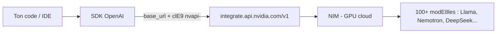
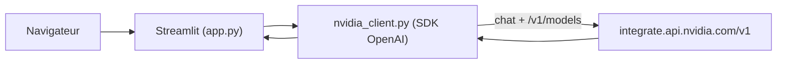

# build.nvidia.com : l'IA de pointe sans GPU, sans stockage, sans galère

NVIDIA vient de faire sauter le plus gros frein de l'IA locale : le matériel.
Avec **build.nvidia.com**, tu accèdes à **100+ modèles d'IA de pointe** (Llama,
Nemotron, DeepSeek, GLM, gpt-oss, Qwen, Kimi…) via une **API gratuite, compatible
OpenAI**. Plus besoin de télécharger 200 Go de poids, plus besoin d'un GPU à
2 000 $, plus de « disque plein ». Tu changes deux lignes dans ton code et tu
tournes sur les GPU de NVIDIA, dans le cloud.

Cet article déballe tout, avec du **vrai code copiable** — et à la fin, on
branche le tout dans une vraie app web (le projet livré dans ce dossier).

---

## TL;DR

- **build.nvidia.com** = catalogue d'inférence hébergée NVIDIA (marque **NIM**), endpoint **compatible OpenAI**.
- **Base URL unique** : `https://integrate.api.nvidia.com/v1` + une clé `nvapi-`. Tu réutilises le SDK OpenAI tel quel.
- **Gratuit** : ~1 000 crédits à l'inscription (jusqu'à 5 000 sur demande), ~40 requêtes/min, sans carte bancaire, sans GPU.
- **100+ modèles** + des **Agentic Skills** (capacités prêtes à l'emploi pour tes agents).
- Idéal pour **prototyper** : adieu les limites de stockage et de VRAM de ta machine.



> **Note sur les noms de modèles.** Certains articles qui circulent citent des
> identifiants **inventés** (`deepseek-v4-pro`, etc.). Dans la pratique, on
> récupère toujours la **vraie liste** via l'endpoint `/v1/models`. Les IDs
> utilisés ici sont réels et vérifiables.

---

## 1. C'est quoi build.nvidia.com (NVIDIA NIM) ?

Depuis 2024, NVIDIA déploie **NIM** (*NVIDIA Inference Microservices*) : une
couche qui sert des modèles d'IA optimisés pour ses GPU. Il y a deux moitiés :

1. des **conteneurs** que tu peux héberger toi-même ;
2. un **catalogue d'inférence hébergée** — c'est ce dernier qui fait du bruit sur build.nvidia.com.

L'idée géniale : l'endpoint est **compatible avec l'API OpenAI**. Concrètement,
n'importe quel outil, framework ou app qui sait pointer vers une « base URL »
personnalisée peut viser NVIDIA **sans aucune autre modification de code**.
Streaming, function calling, tool use : tout fonctionne comme avec OpenAI.

> **« Compatible OpenAI »** veut dire que la forme des requêtes et réponses
> (*Chat Completions*) est identique. Tu gardes ton code, tu changes juste
> `base_url` et `api_key`.

### Pourquoi c'est une bombe : fini les modèles en local

| Critère | Modèle en local | Endpoint NVIDIA |
| --- | --- | --- |
| Stockage | 40 à 400+ Go par modèle | 0 Go (rien à télécharger) |
| Matériel | GPU avec beaucoup de VRAM | Aucun (GPU côté NVIDIA) |
| Mise en route | Heures (drivers, poids, quantization) | ~3 minutes (une clé) |
| Choix de modèles | Ce que ta machine encaisse | 100+ modèles, dont des 500B+ |
| Coût d'entrée | Élevé (carte graphique) | Gratuit (crédits offerts) |
| Confidentialité | Tout reste chez toi | Les données transitent par NVIDIA |

---

## 2. Démarrer en 3 minutes : ta clé `nvapi-`

Le seul prérequis est un **compte gratuit** du programme développeur NVIDIA.
Pas de carte bancaire.

1. Va sur [build.nvidia.com](https://build.nvidia.com) et connecte-toi.
2. Ouvre n'importe quel modèle.
3. Clique sur **Get API Key**.
4. Copie la clé qui commence par `nvapi-` — **elle n'est affichée qu'une seule fois**.

```bash
# 1. Stocke ta clé dans une variable d'environnement
export NVIDIA_API_KEY="nvapi-xxxxxxxxxxxxxxxxxxxxxxxx"   # Windows PowerShell : $env:NVIDIA_API_KEY="nvapi-..."

# 2. Installe le SDK OpenAI (oui, celui d'OpenAI)
pip install openai
```

> **Attention.** La clé `nvapi-` n'est montrée qu'une seule fois. Copie-la tout
> de suite et **ne la commit jamais** dans Git. Utilise une variable
> d'environnement ou un fichier `.env` ignoré.

---

## 3. Ton premier appel (Python)

Voici l'exemple le plus court qui marche. Remarque les **deux seules choses**
spécifiques à NVIDIA : `base_url` et la clé.

```python
import os
from openai import OpenAI

client = OpenAI(
    base_url="https://integrate.api.nvidia.com/v1",
    api_key=os.environ["NVIDIA_API_KEY"],
)

resp = client.chat.completions.create(
    model="deepseek-ai/deepseek-r1",
    messages=[{"role": "user", "content": "Explique le RAG en 3 phrases."}],
    temperature=0.7,
    max_tokens=1024,
)
print(resp.choices[0].message.content)
```

---

## 4. Streaming, Node.js et cURL

Le **streaming** (afficher la réponse mot à mot) fonctionne comme avec OpenAI :

```python
stream = client.chat.completions.create(
    model="meta/llama-3.3-70b-instruct",
    messages=[{"role": "user", "content": "Écris un haïku sur le GPU."}],
    stream=True,
)
for chunk in stream:
    print(chunk.choices[0].delta.content or "", end="")
```

En **Node.js**, c'est exactement le même SDK :

```javascript
import OpenAI from "openai";

const client = new OpenAI({
  baseURL: "https://integrate.api.nvidia.com/v1",
  apiKey: process.env.NVIDIA_API_KEY,
});

const r = await client.chat.completions.create({
  model: "openai/gpt-oss-120b",
  messages: [{ role: "user", content: "Salut depuis Node !" }],
});
console.log(r.choices[0].message.content);
```

Et en pur **cURL**, sans aucun SDK :

```bash
curl https://integrate.api.nvidia.com/v1/chat/completions \
  -H "Authorization: Bearer $NVIDIA_API_KEY" \
  -H "Content-Type: application/json" \
  -d '{
    "model": "nvidia/llama-3.1-nemotron-ultra-253b-v1",
    "messages": [{"role": "user", "content": "Bonjour !"}]
  }'
```

---

## 5. Lister tous les modèles dispo (endpoint `/v1/models`)

L'endpoint `/v1/models` est lui aussi compatible OpenAI. C'est **la** bonne
façon de connaître les IDs exacts (la liste bouge souvent).

```bash
curl -s https://integrate.api.nvidia.com/v1/models \
  -H "Authorization: Bearer $NVIDIA_API_KEY" | jq '.data[].id'
```

En Python avec le SDK :

```python
for model in client.models.list():
    print(model.id)
```

C'est précisément ce que fait l'app de ce dossier : elle remplit son sélecteur
de modèles dynamiquement, et retombe sur une liste de secours si l'appel échoue.

---

## 6. Brancher Cursor, Claude Code et LangChain dessus

Comme l'endpoint est compatible OpenAI, tu peux le brancher **partout où on
accepte une base URL personnalisée**. Pour **Cursor** : dans les réglages des
modèles, renseigne la base URL `https://integrate.api.nvidia.com/v1` et ta clé
`nvapi-`. Même logique pour **Claude Code, LangChain, CrewAI ou AutoGen** : on
change seulement la base URL et l'ID du modèle.

```python
from langchain_openai import ChatOpenAI

llm = ChatOpenAI(
    base_url="https://integrate.api.nvidia.com/v1",
    api_key="nvapi-VOTRE_CLE",
    model="meta/llama-3.3-70b-instruct",
)
print(llm.invoke("Donne-moi 3 idées de projets IA pour débuter.").content)
```

---

## 7. Les modèles dispo + les Agentic Skills

Le catalogue dépasse les 100 modèles. Quelques familles **réelles** que tu
trouveras sur l'endpoint :

| Famille | Exemples d'IDs réels | Usage typique |
| --- | --- | --- |
| DeepSeek | `deepseek-ai/deepseek-r1`, `deepseek-ai/deepseek-v3.1` | Raisonnement, code |
| Llama (Meta) | `meta/llama-3.3-70b-instruct`, `meta/llama-3.1-405b-instruct` | Généraliste |
| Nemotron (NVIDIA) | `nvidia/llama-3.1-nemotron-ultra-253b-v1`, `nvidia/llama-3.3-nemotron-super-49b-v1.5` | Raisonnement, agents |
| gpt-oss (OpenAI open weights) | `openai/gpt-oss-120b` | Généraliste |
| Qwen | `qwen/qwen3-235b-a22b` | Long contexte, multilingue |
| Kimi (Moonshot) | `moonshotai/kimi-k2-instruct` | Long contexte |
| Mistral | `mistralai/mistral-large-2-instruct` | Généraliste |

> Quel « équivalent Opus » choisir ? Pour le **raisonnement**, vise
> `deepseek-ai/deepseek-r1` ou un Nemotron *ultra/super*. Pour la **vitesse**,
> un Llama 70B fait très bien le travail.

NVIDIA pousse aussi les **Agentic Skills** : des capacités prêtes à l'emploi que
ton agent peut appeler, rangées par domaine (AI & Machine Learning, Accelerated
Computing, Physical AI, Developer Tools). De quoi assembler un agent qui **agit**,
pas seulement qui discute.

> La liste de modèles bouge souvent. Filtre sur **« Free Endpoint »** dans le
> catalogue pour ne voir que les modèles gratuits.

---

## 8. Les limites du gratuit (à connaître)

| Limite (2026) | Valeur |
| --- | --- |
| Crédits à l'inscription | ~1 000 crédits d'inférence |
| Crédits max sur demande | Jusqu'à ~5 000 |
| Débit (rate limit) | ~40 requêtes / minute |
| Préfixe de clé | `nvapi-` |
| Carte bancaire | Non requise |

Si tu dépasses le débit, l'API renvoie une erreur **429 Too Many Requests**. La
parade classique : espacer les appels et réessayer avec un **délai croissant
(backoff)**.

```python
import time
from openai import OpenAI

client = OpenAI(base_url="https://integrate.api.nvidia.com/v1",
                api_key="nvapi-VOTRE_CLE")

def chat_avec_retry(messages, model="meta/llama-3.3-70b-instruct", essais=5):
    for i in range(essais):
        try:
            return client.chat.completions.create(model=model, messages=messages)
        except Exception as e:
            if "429" in str(e) and i < essais - 1:
                time.sleep(2 ** i)   # 1s, 2s, 4s, 8s...
                continue
            raise
```

> **Confidentialité.** Sur l'essai gratuit, tes entrées et sorties **peuvent
> être enregistrées** par NVIDIA pour fournir et améliorer le service. N'envoie
> pas de données confidentielles ou personnelles sensibles via le palier gratuit.

---

## 9. Quand rester en local malgré tout

L'endpoint ne tue pas le local — il le **complète**. Tu restes en local quand :

1. tes **données sont sensibles** et ne doivent pas sortir ;
2. tu travailles **hors-ligne** ;
3. tu veux une **latence ultra-stable** ;
4. tu es à **grande échelle** et l'auto-hébergement revient moins cher.

Pour tout le reste — prototypage, démos, side-projects, apprentissage —
l'endpoint gratuit est imbattable. Et le jour où tu veux passer en prod
auto-hébergée, NVIDIA propose une licence R&D et des essais de NIM/AI Enterprise.

---

## 10. L'app livrée dans ce dossier

Ce dépôt contient un **clone de Claude** (façon Opus) en **Streamlit**, branché
sur l'endpoint NVIDIA, qui met en pratique tout ce qui précède :

- sélecteur de modèles **dynamique** (`/v1/models`) avec liste de secours réelle ;
- **streaming** mot à mot via `st.write_stream` ;
- affichage de la **chaîne de raisonnement** (modèles type DeepSeek-R1 / Nemotron) dans un volet repliable ;
- **retry/backoff** automatique sur les erreurs 429 ;
- gestion de la clé via la barre latérale ou un fichier `.env` (jamais commité).



Pour le lancer :

```bash
pip install -r requirements.txt
# place ta clé dans .env (voir .env.example), puis :
streamlit run app.py
```

Détails d'installation et de dépannage dans le `README.md`.

---

### En résumé

Une clé `nvapi-`, une base URL, le SDK OpenAI que tu connais déjà : c'est tout
ce qu'il faut pour passer de « mon laptop chauffe » à « 100+ modèles de pointe
sur les GPU de NVIDIA ». Récupère ta clé, lance l'app, et code.
