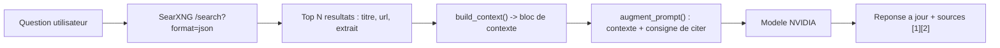

# 02 — Booster les réponses avec la recherche web (SearXNG / RAG web)

> Problème : le modèle répond **de mémoire** (ex. « dernière mise à jour octobre
> 2023 »), donc ses infos peuvent être périmées. Solution : on cherche sur le
> web **avant** de répondre, et on injecte les résultats frais dans le prompt.

## Pourquoi SearXNG ?

SearXNG est un **métamoteur** auto-hébergé : il interroge Google, Bing, DuckDuckGo,
etc. et agrège les résultats. Avantages :

- **gratuit** et **privé** (tu héberges, pas de clé externe) ;
- **API JSON** simple (`/search?q=...&format=json`) ;
- pas de quota d'API tiers.

## Comment ça marche (RAG web)



Le LLM **ne navigue pas** : `web_search.py` fait la recherche, formate les
résultats, et `app.py` les injecte dans le dernier message utilisateur. La
consigne demande au modèle de **citer ses sources** ([1], [2]…).

## Étape 1 — Lancer SearXNG (Docker)

Prérequis : Docker Desktop installé.

```powershell
# Genere une cle secrete et colle-la dans searxng/settings.yml (champ secret_key)
python -c "import secrets; print(secrets.token_hex(32))"

# Demarre SearXNG
docker compose up -d
```

Vérifie :

- Interface : http://localhost:8888
- API JSON : http://localhost:8888/search?q=test&format=json

> Si l'API JSON renvoie **403 "format not allowed"**, c'est que le format `json`
> n'est pas activé. Il l'est déjà dans `searxng/settings.yml` (section
> `search.formats`). Relance : `docker compose restart`.

## Étape 2 — Activer dans l'app

1. Lance l'app : `streamlit run app.py`
2. Dans la barre latérale, section **Recherche web (SearXNG)** :
   - active **« Activer la recherche web »** ;
   - vérifie l'**URL SearXNG** (défaut `http://localhost:8888`) ;
   - règle le **nombre de résultats** (1–10).
3. Pose ta question : l'app cherche d'abord, affiche un volet **« Sources web »**,
   puis le modèle répond en citant les sources.

## Fichiers concernés

| Fichier | Rôle |
| --- | --- |
| `web_search.py` | Requête SearXNG, formatage du contexte, enrichissement du prompt |
| `docker-compose.yml` | Lance le conteneur SearXNG (port 8888) |
| `searxng/settings.yml` | Active le format JSON + clé secrète |
| `app.py` | Toggle recherche web, injection du contexte, affichage des sources |

## Dépannage

| Problème | Cause | Solution |
| --- | --- | --- |
| « Recherche web indisponible » | SearXNG éteint | `docker compose up -d` |
| 403 format not allowed | JSON non activé | Vérifie `search.formats: [html, json]` puis `docker compose restart` |
| 429 sur SearXNG | Limiter actif | `limiter: false` dans `settings.yml` (déjà fait) |
| Réponse sans sources | Aucun résultat / requête trop pointue | Augmente le nb de résultats, reformule |

## Alternatives à SearXNG

Si tu ne veux pas héberger : **Tavily**, **Brave Search API**, **Serper** ou
**Exa** offrent des API de recherche clé en main (souvent un palier gratuit).
Le principe reste identique : chercher → injecter le contexte → demander de
citer. Il suffirait d'écrire un autre `search()` dans `web_search.py`.
