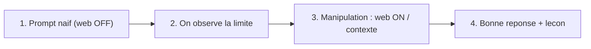

# 03 — Exercices : les limites du LLM seul, et pourquoi la recherche web (RAG)

> Document pédagogique. Objectif : faire **vivre aux étudiants** les limites d'un
> LLM utilisé seul, puis leur montrer la manipulation qui corrige le tir
> (activer la recherche web), et enfin la bonne réponse. Chaque exercice suit le
> même rythme : **on échoue d'abord, on comprend pourquoi, on corrige.**

## Pré-requis

- L'app du projet lancée (`streamlit run app.py` ou Docker).
- SearXNG accessible (voir `documentation/02`). En local : champ « URL SearXNG »
  = `http://localhost:8888`. En Docker : `http://searxng:8080` (déjà géré).
- Dans la barre latérale, un interrupteur **« Activer la recherche web »**.

## La méthode pédagogique en 3 temps



## INSTRUCTIONS AUX ÉTUDIANTS (à suivre pour CHAQUE exercice)

> Le but n'est pas d'avoir tout de suite la bonne réponse, mais de **voir la
> différence** entre « LLM seul » et « LLM + recherche web ». On fait donc
> toujours deux essais : d'abord **sans**, puis **avec**.

1. Ouvre l'application dans le navigateur (`http://localhost:8501`).
2. Regarde la **barre latérale à gauche**, section **« Recherche web (SearXNG) »**.
3. **Essai 1 — sans web :** laisse l'interrupteur **« Activer la recherche web »
   DÉCOCHÉ**. Pose la question. **Note la réponse** (exercice : fiche élève).
4. **COCHE** maintenant l'interrupteur **« Activer la recherche web »**
   (vérifie que l'URL SearXNG est `http://localhost:8888` en local).
5. **Essai 2 — avec web : REPOSE EXACTEMENT LA MÊME QUESTION.**
6. Déplie le volet **« Sources web »** sous la réponse et **clique les liens**
   pour vérifier.
7. **Compare** les deux réponses et écris ta conclusion.

> Astuce : si tu changes de question, clique sur **« Nouvelle conversation »**
> pour repartir d'un historique propre. Si tu vois « Recherche web
> indisponible », c'est que SearXNG n'est pas lancé (voir `documentation/02`).

> Mémo : **DÉCOCHÉ = LLM seul (mémoire figée)**, **COCHÉ = LLM + web (à jour, avec
> sources)**. Coche, puis reteste : c'est là que la magie opère.

## Le cas d'école (à montrer en premier)

**Prompt :** `Qui est le premier ministre du Canada ?`

- **LLM seul (web OFF)** — réponse périmée :
  > « D'après ma date de coupure (octobre 2023), le premier ministre du Canada
  > est **Justin Trudeau**… »
- **Manipulation :** active **« Recherche web »** et repose la même question.
- **LLM + web (RAG)** — réponse à jour avec sources :
  > « **Mark Carney** est le premier ministre du Canada, ayant prêté serment le
  > 14 mars 2025 [2, 3]. »

**Leçon :** un LLM répond *de mémoire*, figée à sa date d'entraînement
(*knowledge cutoff*). Pour toute info récente, il faut lui **fournir le contexte**
(ici via la recherche web). C'est le principe du **RAG** (*Retrieval-Augmented
Generation*).

---

## Les 6 limites à faire découvrir (un exercice chacune)

### Exercice 1 — La date de coupure (knowledge cutoff)

- **But :** montrer que le savoir du modèle s'arrête à une date.
- **Étape 1 (web OFF) :** `Quel est le dernier modèle d'IA sorti cette semaine ?`
  → le modèle invente ou dit qu'il ne sait pas après sa date de coupure.
- **Étape 2 (manipulation) :** active la recherche web.
- **Étape 3 (web ON) :** même prompt → réponse datée + sources `[1][2]`.
- **À retenir :** « récent » = angle mort du LLM seul.

### Exercice 2 — L'hallucination de faits précis

- **But :** montrer qu'un LLM peut inventer avec aplomb.
- **Étape 1 (web OFF) :** `Donne le score exact et les buteurs du dernier match
  de l'équipe de France de football.`
  → chiffres et noms plausibles mais **faux/inventés**.
- **Étape 2 :** active la recherche web.
- **Étape 3 (web ON) :** même prompt → score réel + sources.
- **À retenir :** la confiance du ton n'est pas une preuve d'exactitude.
  Toujours demander/vérifier les **sources**.

### Exercice 3 — « Quelle heure / quel jour est-il ? »

- **But :** montrer l'absence d'horloge et de temps réel.
- **Étape 1 (web OFF) :** `Quelle est la date d'aujourd'hui et la météo à
  Montréal maintenant ?`
  → le modèle ne peut pas savoir (ou invente).
- **Étape 2 :** recherche web ON.
- **Étape 3 :** la météo du jour avec source météo.
- **À retenir :** le LLM n'a **ni horloge ni capteurs** ; il lui faut un outil.

### Exercice 4 — Données chiffrées qui bougent (prix, cours, versions)

- **But :** montrer que les valeurs volatiles sont périmées.
- **Étape 1 (web OFF) :** `Quel est le prix actuel du Bitcoin et la dernière
  version stable de Python ?`
  → valeurs datées de la période d'entraînement.
- **Étape 2 :** recherche web ON.
- **Étape 3 :** valeurs du jour + sources.
- **À retenir :** pour tout ce qui « change tout le temps », le RAG est obligatoire.

### Exercice 5 — Les sources et la vérifiabilité

- **But :** apprendre à **exiger des citations**.
- **Étape 1 (web ON) :** `Cite 3 sources récentes sur l'état de l'IA en 2026 et
  résume chacune en une phrase, avec le lien.`
- **Étape 2 (manipulation) :** vérifie le volet « Sources web » et **clique les liens**.
- **À retenir :** une bonne réponse RAG est **traçable**. Si une affirmation n'a
  pas de source, traite-la comme une hypothèse.

### Exercice 6 — Quand le LLM seul SUFFIT (contre-exemple)

- **But :** montrer qu'on n'active pas le web pour tout.
- **Étape 1 (web OFF) :** `Explique la différence entre une liste et un tuple en
  Python, avec un exemple.`
  → réponse correcte **sans** web (connaissance stable, non datée).
- **À retenir :** la recherche web coûte du temps/des requêtes. On l'active pour
  l'**actualité, les chiffres volatils, les faits vérifiables**, pas pour les
  concepts stables.

---

## Tableau récapitulatif : limite → symptôme → parade

| Limite du LLM seul | Symptôme observé | Parade dans l'app |
| --- | --- | --- |
| Date de coupure | « En octobre 2023… » | Recherche web ON |
| Hallucination | Faits faux dits avec assurance | Web ON + exiger sources |
| Pas de temps réel | Date/météo fausses | Web ON |
| Valeurs volatiles | Prix/versions périmés | Web ON |
| Non-vérifiable | Aucune source | Demander citations `[n]` |
| (rien) concept stable | Réponse déjà correcte | Web OFF (inutile) |

---

## Banque de prompts (à copier-coller)

### A. Prompts « piège » à faire d'abord SANS recherche web

```text
Qui est le premier ministre du Canada ?
Quel est le président des États-Unis actuellement ?
Quelle est la dernière version stable de Node.js ?
Quel est le cours actuel de l'action NVIDIA ?
Quels sont les modèles d'IA sortis ce mois-ci ?
Quel temps fait-il aujourd'hui à Paris ?
Qui a gagné le dernier Grand Prix de F1 ?
Quelle est la date d'aujourd'hui ?
```

### B. Les mêmes, à reposer AVEC la recherche web activée

> Reposer exactement la même question après avoir activé « Recherche web »,
> puis comparer la réponse et regarder le volet « Sources web ».

### C. Prompts qui exigent la vérifiabilité (web ON)

```text
Réponds uniquement à partir de sources de moins de 12 mois et cite chaque
affirmation avec [n]. Question : quelles sont les nouveautés d'OpenAI en 2026 ?

Compare deux sources qui se contredisent sur ce sujet et explique laquelle
semble la plus fiable, avec les liens.

Si les sources ne suffisent pas pour répondre, dis-le explicitement plutôt
que de deviner. Question : ...
```

### D. Prompts « contrôle » qui marchent SANS web (concepts stables)

```text
Explique la récursivité avec une analogie simple.
Quelle est la différence entre HTTP et HTTPS ?
Écris une fonction Python qui inverse une chaîne de caractères.
```

---

## Fiche élève — à remplir pendant la séance

Pour chaque exercice, note :

1. **Réponse SANS web** (copie-la) :
2. **Est-elle correcte / à jour ?** (oui / non / impossible à dire) :
3. **Réponse AVEC web** (copie-la) :
4. **Sources citées** (combien, lesquelles) :
5. **Conclusion** (que t'a appris cet exercice ?) :

---

## Pour l'enseignant — points clés à marteler

- Un LLM **prédit du texte plausible**, il ne « sait » pas et n'a pas accès au
  présent. Sans contexte, il répond avec sa mémoire figée.
- Le **RAG** = on cherche l'info à jour, on l'**injecte dans le prompt**, on
  demande au modèle de **citer**. Le modèle ne navigue pas : c'est l'application
  qui apporte les faits.
- **Vérifier les sources** est une compétence, pas une option.
- La recherche web n'est **pas gratuite** (temps, requêtes) : on l'active à bon
  escient (actualité, chiffres, faits), pas pour les concepts stables.
