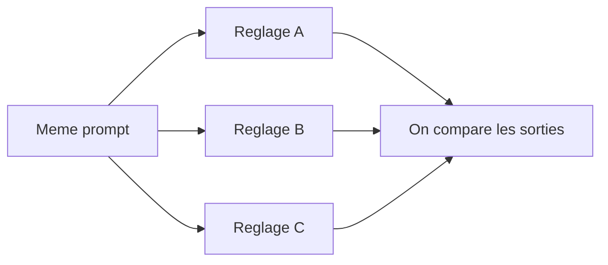

# 04 — Exercices guidés : température, top-p et max tokens

> Document pédagogique. Objectif : faire **comprendre par l'expérience** les trois
> réglages qui contrôlent la génération d'un LLM. On pose **la même question**
> plusieurs fois en changeant **un seul réglage à la fois**, et on observe ce qui
> change.

## Les 3 réglages en une phrase

| Réglage | Ce qu'il contrôle | Image mentale |
| --- | --- | --- |
| **Température** | Le hasard / la créativité | 0 = robot prévisible, 1.5 = artiste imprévisible |
| **Top-p** | La largeur du vocabulaire considéré | 0.1 = mots les plus sûrs, 1.0 = tous les mots possibles |
| **Max tokens** | La **longueur maximale** de la réponse | un plafond de mots (la réponse peut être coupée) |

> Un **token** ≈ un morceau de mot (~4 caractères en moyenne). 100 tokens ≈ 75 mots.

## Règle d'or de la méthode scientifique

**On ne change qu'UN paramètre à la fois.** Sinon, impossible de savoir lequel a
causé le changement. On garde donc les autres réglages fixes pendant chaque
exercice.

## Préparation (à faire une fois)

1. Ouvre l'app (`http://localhost:8501`).
2. Dans la barre latérale :
   - **DÉCOCHE** « Activer la recherche web » (on veut observer le modèle seul).
   - Choisis un modèle **non-raisonnant** pour des effets bien visibles, ex.
     `meta/llama-3.3-70b-instruct` (les modèles « thinking » lissent parfois les écarts).
3. Repère les trois curseurs : **Température**, **Top-p**, **Tokens max**.
4. Entre deux essais, clique **« Nouvelle conversation »** pour repartir propre.



---

## Exercice 1 — La TEMPÉRATURE (le hasard)

**Réglages fixes :** Top-p = `0.95`, Tokens max = `512`.
**Prompt (créatif, pour bien voir l'effet) :**

```text
Invente un slogan original pour une marque de café québécoise.
```

Pose-le **trois fois**, en changeant seulement la température, et en cliquant
« Nouvelle conversation » à chaque fois :

| Essai | Température | Pose la question 2 fois — les réponses sont… |
| --- | --- | --- |
| 1 | `0.0` | … quasi **identiques** (déterministe) |
| 2 | `0.7` | … **variées mais cohérentes** (équilibre) |
| 3 | `1.4` | … **très différentes**, parfois farfelues/incohérentes |

**À retenir :**
- Température **basse** → réponses **stables et sûres** (idéal : extraction,
  code, réponses factuelles, données).
- Température **haute** → réponses **créatives et imprévisibles** (idéal :
  brainstorming, écriture, idées) — mais risque d'incohérence.

**Test inverse (très parlant) :** repose une question **factuelle**
(`Quelle est la capitale de l'Australie ?`) à température `0.0` puis `1.4`.
À `0.0` c'est net ; à `1.4` ça peut partir en digressions. Conclusion : pour
les faits, on baisse la température.

---

## Exercice 2 — Le TOP-P (la largeur du choix)

**Réglages fixes :** Température = `1.0`, Tokens max = `512`.
**Prompt :**

```text
Donne 8 idées de noms pour une boutique de plantes.
```

| Essai | Top-p | Observation attendue |
| --- | --- | --- |
| 1 | `0.1` | Noms **classiques, attendus** (le modèle se limite aux mots les plus probables) |
| 2 | `0.95` | Bon **mélange** de sûr et d'original |
| 3 | `1.0` | Noms **plus variés/audacieux**, parfois bizarres |

**À retenir :** le top-p (échantillonnage « nucleus ») limite le modèle aux mots
dont la probabilité cumulée atteint *p*. Plus *p* est petit, plus le vocabulaire
est **restreint et sûr**.

> Température et top-p agissent **tous les deux sur la diversité**. En pratique,
> on **règle l'un et on laisse l'autre** (ex. température 0.7 + top-p 0.95).
> Ne pas pousser les deux au maximum en même temps (sorties incontrôlables).

---

## Exercice 3 — Les MAX TOKENS (la longueur)

**Réglages fixes :** Température = `0.7`, Top-p = `0.95`.
**Prompt (volontairement long à produire) :**

```text
Explique en détail le fonctionnement d'un moteur à combustion, étape par étape.
```

| Essai | Tokens max | Observation attendue |
| --- | --- | --- |
| 1 | `64` | Réponse **coupée net** au milieu d'une phrase |
| 2 | `256` | Réponse **partielle** mais lisible |
| 3 | `2048` | Réponse **complète** |

**À retenir :**
- `max_tokens` est un **plafond** : si la réponse est plus longue, elle est
  **tronquée** (pas résumée — vraiment coupée).
- Plus de tokens = réponse potentiellement plus longue = **plus lent** et
  **plus de crédits** consommés.
- Pour forcer une réponse courte, mieux vaut le **demander dans le prompt**
  (« en 2 phrases ») que de couper avec `max_tokens` (qui coupe brutalement).

---

## Exercice 4 — Combiner pour un objectif

Pour chaque besoin, propose tes réglages, puis teste :

| Besoin | Température | Top-p | Tokens max | Pourquoi |
| --- | --- | --- | --- | --- |
| Extraire des données d'un texte | `0.0–0.2` | `1.0` | selon la sortie | On veut du **fiable et reproductible** |
| Écrire un poème | `1.0–1.3` | `0.95` | `512` | On veut de la **créativité** |
| Résumé factuel court | `0.3` | `0.9` | `200` | **Précis et bref** |
| Brainstorming d'idées | `1.2` | `1.0` | `800` | **Diversité** maximale |
| Génération de code | `0.0–0.3` | `0.95` | `1500` | Le code doit être **correct, pas créatif** |

---

## Fiche élève — à remplir

Pour chaque exercice :

1. **Prompt utilisé** :
2. **Réglage testé et sa valeur** :
3. **Réponse obtenue (résumé ou copie)** :
4. **Qu'est-ce qui a changé par rapport à l'essai précédent ?** :
5. **Dans quel cas réel utiliserais-tu ce réglage ?** :

### Mini-quiz de fin

1. Je veux toujours la **même** réponse à une question factuelle : quelle
   température ?
2. Ma réponse est **coupée au milieu** : quel réglage augmenter ?
3. Je fais un **brainstorming créatif** : température basse ou haute ?
4. Vrai ou faux : « augmenter max_tokens rend le modèle plus intelligent ».
5. Pourquoi est-il déconseillé de mettre température **et** top-p au maximum ?

*(Réponses : 1) ~0.0  2) max_tokens  3) haute  4) Faux, ça allonge seulement la
limite de longueur  5) sorties trop aléatoires/incohérentes.)*

---

## Pour l'enseignant — points clés

- **Température** et **top-p** contrôlent le **hasard/diversité** ; **max tokens**
  contrôle la **longueur** (pas la qualité).
- Faire varier **un seul paramètre à la fois** est la leçon de méthode la plus
  importante.
- Insister : `max_tokens` **coupe**, il ne **résume pas**. Pour une réponse
  courte et propre, on le **demande dans le prompt**.
- Les modèles « raisonnants » (DeepSeek-R1, Nemotron…) peuvent **moins** réagir à
  la température sur la réponse finale : pour cet atelier, préférer un modèle
  classique comme `meta/llama-3.3-70b-instruct`.
- Garder la **recherche web désactivée** ici : on étudie le comportement du
  modèle, pas l'apport d'informations externes.
