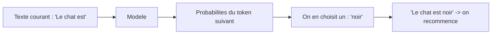
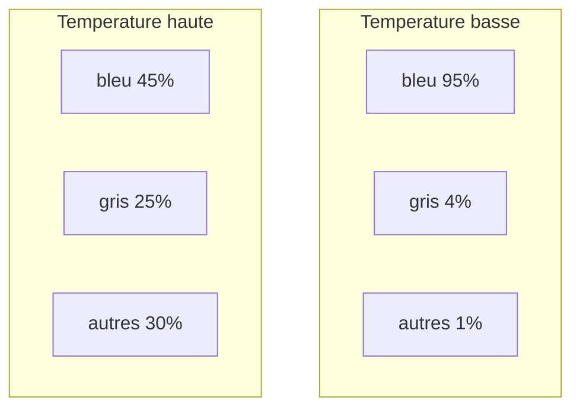
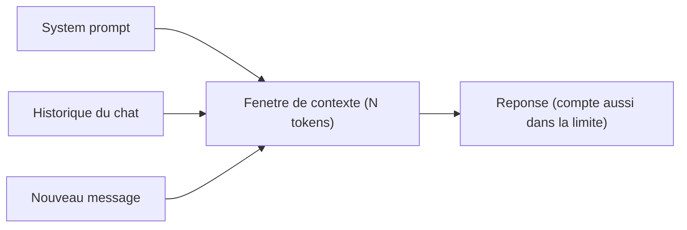

# 05 — Cours : comment un LLM génère du texte (température, top-p, et tout le reste)

> Cours théorique pour comprendre **ce qui se passe vraiment** quand un modèle
> répond, et à quoi servent les réglages. À lire avant ou après les exercices du
> document `04`. Aucune formule compliquée : des analogies, des schémas, des
> exemples.

## Table des matières
1. Le point de départ : un LLM prédit le mot suivant
2. Les tokens (l'unité de base)
3. Des logits aux probabilités (le softmax, en douceur)
4. La **température**
5. Le **top-p** (échantillonnage nucleus)
6. Le **top-k**
7. **max_tokens** (longueur)
8. Pénalités : **frequency** et **presence**
9. **stop** (séquences d'arrêt)
10. La **fenêtre de contexte**
11. Le **system prompt** et les rôles
12. **Déterminisme** et seed
13. Modèles « raisonnants »
14. Récapitulatif et réglages recommandés

---

## 1. Le point de départ : un LLM prédit le mot suivant

Un grand modèle de langage (LLM) fait **une seule chose**, en boucle :
**prédire le prochain token** à partir de tout le texte déjà présent.

Il génère donc **un token à la fois**, en réinjectant à chaque fois ce qu'il
vient d'écrire. Tous les réglages ci-dessous ne font qu'influencer **comment on
choisit** le prochain token parmi tous les possibles.

---

## 2. Les tokens (l'unité de base)

Le modèle ne voit pas des lettres ni vraiment des mots, mais des **tokens** :
des morceaux de texte fréquents.

- 1 token ≈ **4 caractères** en anglais, un peu moins en français.
- 100 tokens ≈ **75 mots**.
- « bonjour » = 1 token ; « anticonstitutionnellement » = plusieurs tokens.

**Pourquoi ça compte :** les limites (`max_tokens`, fenêtre de contexte) et le
coût se comptent **en tokens**, pas en mots.

---

## 3. Des logits aux probabilités (le softmax, en douceur)

À chaque étape, le modèle attribue un **score brut** (appelé *logit*) à **chaque
token possible** du vocabulaire. Ces scores sont transformés en
**probabilités** (qui totalisent 100 %) par une fonction appelée **softmax**.

Exemple, après « Le ciel est » :

| Token candidat | Probabilité |
| --- | --- |
| bleu | 60 % |
| gris | 20 % |
| dégagé | 10 % |
| vert | 0,5 % |
| … | … |

La question devient : **comment piocher** dans cette liste ? C'est exactement ce
que contrôlent température, top-p et top-k.

---

## 4. La température

La **température** redistribue les probabilités **avant** le tirage.

- **Basse (→ 0)** : on accentue les écarts. Le token le plus probable écrase les
  autres → le modèle prend quasi toujours le **plus sûr**. Sortie **déterministe,
  prévisible**.
- **Haute (→ 1.5+)** : on aplatit la distribution. Les tokens rares ont plus de
  chances → sortie **créative, variée, parfois incohérente**.

Analogie : la température, c'est **le grain de folie**.
`0` = comptable méticuleux ; `1.4` = poète sous adrénaline.

**Quand l'utiliser :**
- Faits, extraction, code, classification → **basse** (`0.0–0.3`).
- Brainstorming, écriture créative → **haute** (`0.9–1.3`).

---

## 5. Le top-p (échantillonnage nucleus)

Le **top-p** garde seulement les tokens les plus probables **dont la somme des
probabilités atteint *p***, puis tire parmi eux.

- `top_p = 0.9` → on garde le plus petit groupe de tokens qui cumule 90 % de
  probabilité, on **ignore la longue traîne** improbable.
- `top_p = 1.0` → on garde **tout** le vocabulaire.
- `top_p = 0.1` → on ne garde que **l'élite** des tokens les plus sûrs.

Analogie : top-p = **« on ne considère que les candidats sérieux »**. Plus *p*
est petit, plus le casting est restreint.

> Différence avec la température : la **température déforme** les probabilités ;
> le **top-p coupe** la liste. Les deux réduisent/augmentent la diversité, mais
> autrement.

---

## 6. Le top-k

Variante plus simple : on ne garde que les **k tokens les plus probables**
(ex. `top_k = 40`), peu importe leur probabilité cumulée, puis on tire parmi eux.

- `top_k = 1` → on prend toujours le meilleur (= déterministe, dit « greedy »).
- `top_k = 100` → beaucoup de choix possibles.

En pratique, beaucoup d'API privilégient **température + top-p** ; le top-k n'est
pas toujours exposé (l'app de ce projet utilise température + top-p).

---

## 7. max_tokens (la longueur)

`max_tokens` est le **nombre maximum de tokens générés** dans la réponse.

- C'est un **plafond**, pas un objectif : si la réponse naturelle est plus
  courte, le modèle s'arrête tout seul.
- Si la réponse devait être plus longue, elle est **coupée net** (tronquée),
  parfois en plein milieu d'une phrase.
- Plus de tokens = réponse potentiellement plus longue = **plus lent** + **plus
  de crédits** consommés.

**Bon réflexe :** pour une réponse courte et propre, **demande-le dans le prompt**
(« réponds en 2 phrases ») plutôt que de compter sur `max_tokens` pour couper.

---

## 8. Pénalités : frequency et presence

Deux réglages (pas toujours exposés) pour **éviter les répétitions** :

- **frequency_penalty** : pénalise un token **proportionnellement au nombre de
  fois** où il est déjà apparu → réduit les répétitions de mots.
- **presence_penalty** : pénalise un token **dès qu'il est apparu au moins une
  fois** → pousse le modèle vers de **nouveaux sujets**.

Valeurs typiques : `0` (neutre) à `~1.0`. Utile pour les textes longs qui
« tournent en rond ».

---

## 9. stop (séquences d'arrêt)

Une **séquence d'arrêt** dit au modèle : « arrête-toi dès que tu écris ceci ».

- Exemple : `stop = ["\n\n"]` pour ne générer qu'un paragraphe.
- Très utile pour des formats structurés (arrêter avant une balise, une ligne,
  un séparateur).

---

## 10. La fenêtre de contexte (context window)

C'est la **mémoire de travail** du modèle : le **nombre total de tokens** qu'il
peut « voir » en une fois = **ton prompt + l'historique + sa réponse**.

- Si la conversation dépasse la fenêtre, il faut **tronquer ou résumer** le début.
- Exemples d'ordres de grandeur : de 8 000 à plusieurs **centaines de milliers**
  de tokens selon les modèles.

**Conséquence pratique :** dans un chat long, le modèle peut « oublier » le
début. D'où le bouton **Nouvelle conversation** pour repartir propre.

---

## 11. Le system prompt et les rôles

Les messages ont un **rôle** :

- **system** : les instructions de fond (« Tu es un assistant expert qui répond
  en français, de façon concise »). C'est le **cadre** posé avant tout.
- **user** : ce que dit l'utilisateur.
- **assistant** : ce que le modèle a répondu (sert d'historique).

Le **system prompt** est un levier puissant : ton, langue, format, garde-fous.
Dans l'app, c'est le champ « System prompt » de la barre latérale.

---

## 12. Déterminisme et seed

- À **température 0** (et top-p neutre), le modèle est **quasi déterministe** :
  même entrée → quasi même sortie.
- Certains modèles acceptent un **seed** (graine aléatoire) pour **reproduire**
  exactement une génération — utile pour les tests.
- Sans seed et avec température > 0, deux appels identiques donnent des réponses
  **différentes** : c'est normal, pas un bug.

---

## 13. Les modèles « raisonnants » (reasoning)

Certains modèles (DeepSeek-R1, Nemotron, etc.) produisent d'abord une **chaîne de
pensée** interne (*reasoning*) avant la réponse finale.

- L'app les gère : la réflexion s'affiche dans le volet **« Réflexion du
  modèle »**, séparée de la réponse.
- Effet de bord : la **température influence parfois moins** la réponse finale
  (le raisonnement la « stabilise »). Pour étudier l'effet des réglages,
  préfère un modèle classique comme `meta/llama-3.3-70b-instruct`.

---

## 14. Récapitulatif

| Réglage | Agit sur | Petit = | Grand = |
| --- | --- | --- | --- |
| Température | Hasard | Sûr, répétable | Créatif, instable |
| Top-p | Largeur du choix | Vocabulaire restreint | Tout le vocabulaire |
| Top-k | Nb de candidats | Peu de choix | Beaucoup de choix |
| max_tokens | Longueur max | Réponse courte/coupée | Réponse longue possible |
| frequency_penalty | Répétitions | Répétitions permises | Moins de répétitions |
| presence_penalty | Nouveaux sujets | Reste sur le sujet | Explore d'autres sujets |

### Réglages recommandés par usage

| Usage | Température | Top-p | max_tokens |
| --- | --- | --- | --- |
| Réponse factuelle / extraction | 0.0 – 0.2 | 1.0 | selon besoin |
| Génération de code | 0.0 – 0.3 | 0.95 | 1000 – 2000 |
| Résumé | 0.3 | 0.9 | 200 – 500 |
| Écriture créative | 1.0 – 1.3 | 0.95 | 500 – 1000 |
| Brainstorming | 1.2 | 1.0 | 600 – 1000 |

### Les 5 idées à retenir
1. Un LLM **prédit le token suivant**, encore et encore.
2. **Température** et **top-p/top-k** contrôlent le **hasard/diversité** du choix.
3. **max_tokens** contrôle la **longueur**, pas la qualité ; il **coupe**.
4. La **fenêtre de contexte** est la mémoire de travail (prompt + historique + réponse).
5. Le **system prompt** pose le cadre ; **température 0** ≈ déterministe.

> Pour mettre tout ça en pratique, enchaîne avec les exercices du document
> `04-exercices-temperature-topp-maxtokens.md`.
