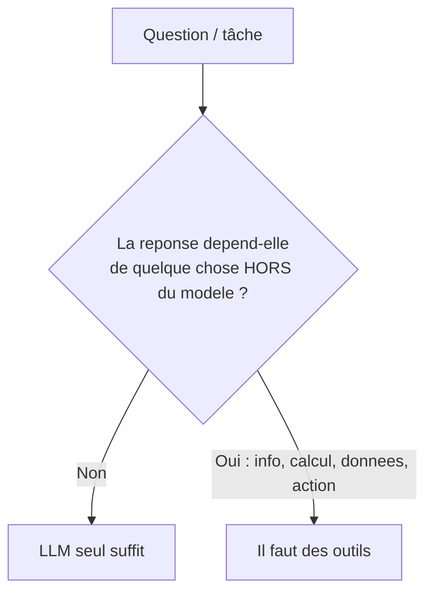
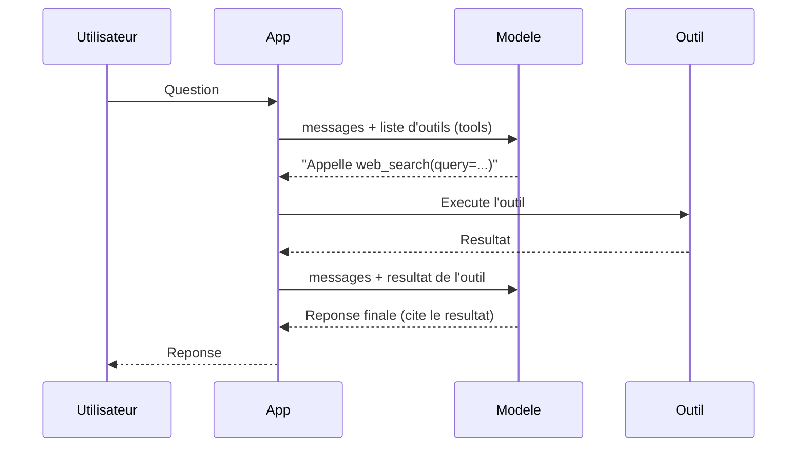

# 06 — LLM seul vs RAG vs Tools (agent) : quand et pourquoi

> Document pédagogique. Objectif : comprendre les **trois niveaux de capacité**
> d'un assistant IA, savoir **quand un modèle plus puissant ne suffit pas**, et
> voir le **function calling** (mode agent) en action dans l'app.

## L'idée centrale à retenir

**Un modèle plus puissant raisonne mieux. Il ne gagne pas de nouvelles
capacités.** Peu importe sa taille, un LLM seul ne peut pas accéder au présent,
calculer exactement, lire tes données privées, ni *agir*. Pour ça → **des outils**.



## Les trois niveaux

| Niveau | Qui décide | Exemple | Limite |
| --- | --- | --- | --- |
| **1. LLM seul** | — | « Explique la récursivité » | Mémoire figée, pas d'action |
| **2. RAG (manuel)** | **Toi** | Tu coches « Recherche web », on injecte le contexte | Toi seul déclenches, 1 type d'info |
| **3. Tools / agent** | **Le modèle** | Le modèle décide d'appeler recherche/calcul/API | Plus complexe, plusieurs allers-retours |

> Dans l'app : le **RAG manuel** = toggle « Recherche web ». Le **mode agent** =
> toggle « Activer le mode agent (function calling) », où le modèle choisit
> lui-même les outils.

## Comment marche le function calling (mode agent)



Étapes :
1. On déclare les **outils** (nom, description, paramètres) au modèle.
2. Le modèle répond soit une **réponse**, soit un **appel d'outil** structuré.
3. L'app **exécute** l'outil et **rend le résultat** au modèle.
4. On boucle jusqu'à la réponse finale.

Le modèle **ne fait jamais l'action lui-même** : il *demande*, ton code *exécute*.

## Les outils fournis dans l'app (`tools.py`)

| Outil | Quand le modèle l'appelle | Pourquoi le LLM seul échoue |
| --- | --- | --- |
| `web_search` | actualité, dates, prix, versions | mémoire figée à la date de coupure |
| `calculator` | tout calcul numérique | le LLM « devine » le texte, il ne calcule pas |

---

## Prompts à COPIER pour voir le modèle appeler les outils

> Mode d'emploi : dans la barre latérale, **COCHE « Activer le mode agent
> (function calling) »**. Pose un des prompts ci-dessous. Sous la réponse,
> déplie le volet **« Outils utilisés »** (ou regarde l'encart « Agent : appels
> d'outils » qui s'affiche en direct) : tu y verras le nom de l'outil appelé.

### Déclenche `web_search` (info à jour)

```text
Quel est le dernier modèle d'IA sorti récemment ?
Qui est le premier ministre du Canada actuellement ?
Quelle est la dernière version stable de Python ?
Quelles sont les actus tech de cette semaine ?
```

### Déclenche `calculator` (calcul exact)

```text
Calcule 18473 * 9244
Combien font 87654 * 4321 ?
Quelle est la racine : (123456 + 7890) * 12 ?
```

### Déclenche PLUSIEURS outils (chaînage)

```text
Cherche la population actuelle du Canada, puis multiplie-la par 2.
Trouve le prix actuel du Bitcoin en dollars, puis calcule la valeur de 3,5 BTC.
```

### Ne déclenche AUCUN outil (concept stable — c'est normal)

```text
Explique la différence entre TCP et UDP en 2 phrases.
Écris une fonction Python qui inverse une chaîne.
```

> Comparaison utile : pose le **même** prompt de calcul **mode agent OFF** puis
> **ON**. OFF → souvent un nombre faux ; ON → résultat exact via `calculator`.

---

## Exercices

> Active **« Mode agent »** dans la barre latérale pour ces exercices. Observe le
> volet « Outils utilisés » : tu verras quel outil le modèle a choisi.

### Exercice 1 — Le modèle décide de chercher

- **Prompt :** `Quel est le dernier modèle d'IA sorti récemment ?`
- **Attendu :** le modèle appelle **lui-même** `web_search`, puis répond à jour.
- **Leçon :** différence clé avec le RAG manuel — ici, tu n'as rien coché de
  spécifique ; **le modèle a jugé** qu'il lui fallait chercher.

### Exercice 2 — Le calcul exact

- **Prompt :** `Calcule 18473 * 9244`
- **Étape A — mode agent OFF :** le modèle répond souvent un nombre **faux**.
- **Étape B — mode agent ON :** il appelle `calculator` → résultat **exact**.
- **Leçon :** la puissance du modèle n'aide pas ; il faut l'outil.

### Exercice 3 — Plusieurs outils dans une même demande

- **Prompt :** `Cherche la population actuelle du Canada, puis multiplie-la par 2.`
- **Attendu :** le modèle enchaîne **web_search** puis **calculator** (2 étapes).
- **Leçon :** un agent peut **chaîner** plusieurs outils pour une tâche composée.

### Exercice 4 — Quand l'agent n'appelle RIEN (et c'est normal)

- **Prompt :** `Explique la différence entre TCP et UDP.`
- **Attendu :** **aucun** appel d'outil (« aucune action nécessaire ») — c'est un
  concept stable.
- **Leçon :** un bon agent n'utilise les outils **que si nécessaire**.

---

## Tableau de décision : LLM seul, RAG, ou agent ?

| Situation | Choix recommandé |
| --- | --- |
| Concept, explication, rédaction, code générique | LLM seul |
| Une info à jour précise, déclenchée par toi | RAG manuel |
| Tâche où le modèle doit **choisir/chaîner** des actions | Agent (tools) |
| Calcul exact, accès BD, envoi d'email, appel d'API | Tools obligatoires |

## Pièges et bonnes pratiques

- **Descriptions d'outils claires** : le modèle choisit l'outil d'après sa
  *description*. Mauvaise description = mauvais choix.
- **Limiter le nombre d'étapes** (l'app a un `max_steps`) pour éviter les boucles.
- **Sécurité** : ne jamais exécuter de code arbitraire. La calculatrice de l'app
  utilise un évaluateur **restreint** (pas de `eval()` brut).
- **Tous les modèles ne gèrent pas les tools** aussi bien : privilégie un modèle
  récent qui supporte le function calling.

## À retenir

1. **LLM seul** = raisonnement + connaissances figées.
2. **RAG** = *toi* tu apportes l'info dans le prompt.
3. **Agent (tools)** = *le modèle* décide d'appeler des outils, ton code les exécute.
4. **Un modèle plus puissant ne remplace pas les outils** : présent, calcul exact,
   données privées et actions **exigent** des tools.
